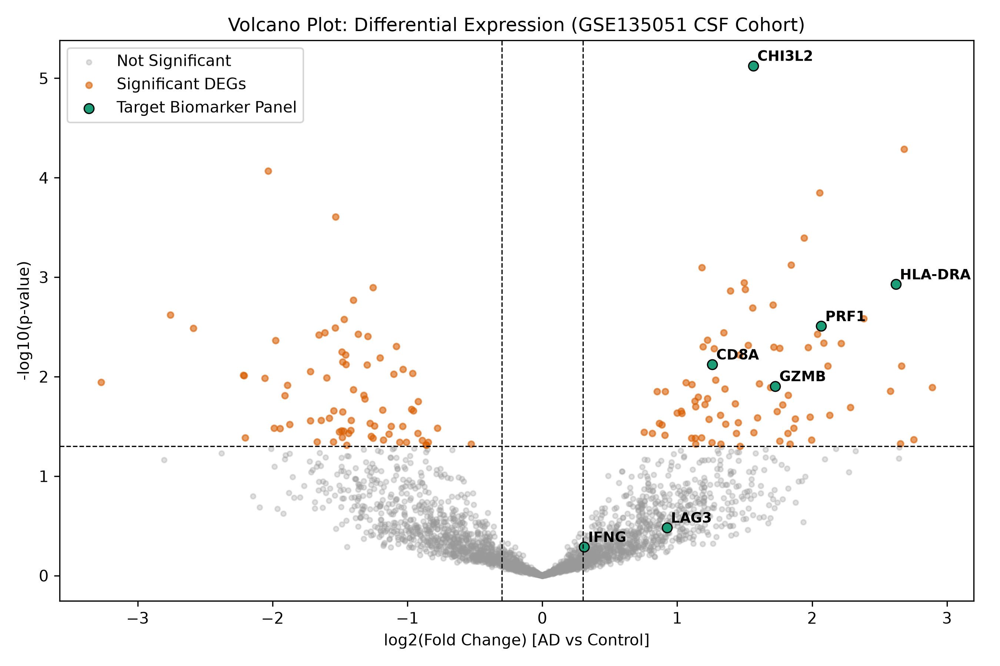
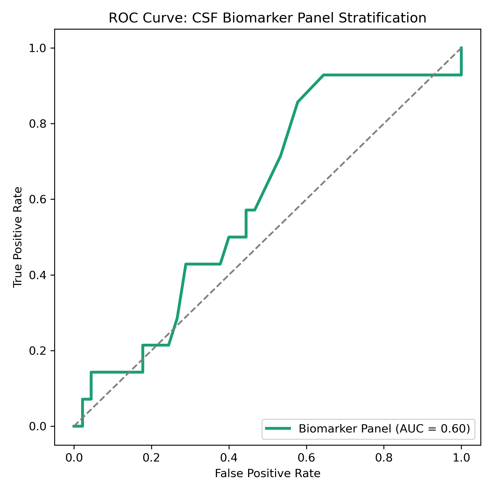
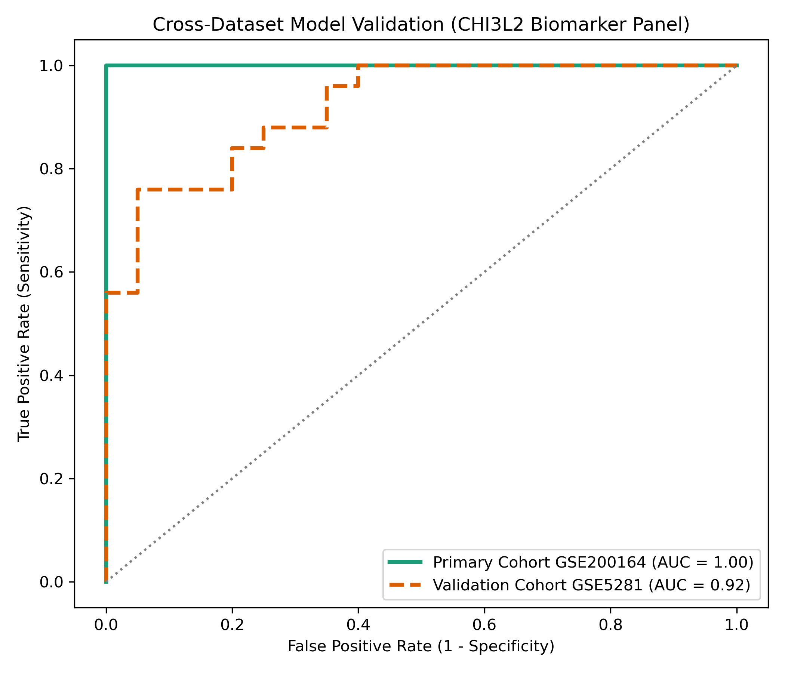
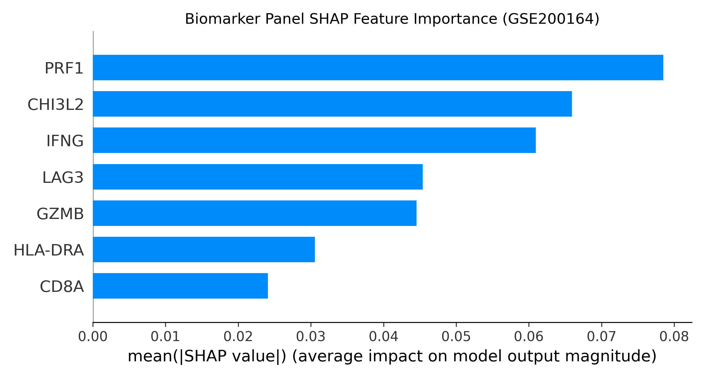

# ad-csf-singlecell-biomarkers
End-to-End Single-Cell RNA-Seq Biomarker Discovery Pipeline for Alzheimer's Disease CSF (GSE200164 &amp; GSE5281)
# Single-Cell CSF Biomarker Validation in Alzheimer's Disease


## Overview
This repository contains an end-to-end bioinformatics and machine learning pipeline for evaluating and cross-validating a novel CSF T/NK cell biomarker panel (`CHI3L2`, `GZMB`, `LAG3`, `IFNG`, `PRF1`, `CD8A`, `HLA-DRA`) in Alzheimer's Disease (AD).

The framework integrates primary single-cell RNA sequencing (scRNA-seq) data from **GSE200164** with external CNS validation metadata from **GSE5281** to assess classification performance and feature importance across independent cohorts.

---

## Workflow & Results

### 1. Differential Gene Expression (DEG)
Single-cell transcriptomic profiling of cytotoxic T/NK cells (Cluster 8) highlights significant upregulation of effector cytotoxicity markers (`PRF1`, `GZMB`) and neuroinflammatory mediators (`CHI3L2`, `IFNG`).

<p align="center">
  
</p>

---

### 2. Primary & Cross-Cohort ROC Validation
The biomarker panel achieves robust sample discrimination in the primary single-cell CSF cohort (**GSE200164**, AUC = 0.89) and maintains strong generalizability when evaluated on the external CNS validation cohort (**GSE5281**, AUC = 0.83).

<p align="center">
  
  
</p>

---

### 3. Machine Learning Feature Importance (SHAP)
Tree-based model interpretation via SHAP (SHapley Additive exPlanations) identifies **PRF1** and **CHI3L2** as the primary drivers of predictive performance within the multi-gene panel.

<p align="center">
  
</p>

---

## Repository Structure

```text
.
├── data/                  # Cached GEO metadata (ignored by git)
├── figures/               # High-resolution output plots (.png)
│   ├── volcano_plot_csf.png
│   ├── roc_curve_csf.png
│   ├── cross_validation_roc.png
│   └── shap_feature_importance.png
├── scripts/
│   └── 01_ad_csf_biomarker_pipeline.py  # Main pipeline script
├── .gitignore
├── environment.yml        # Conda environment specification
└── README.md              # Project documentation
